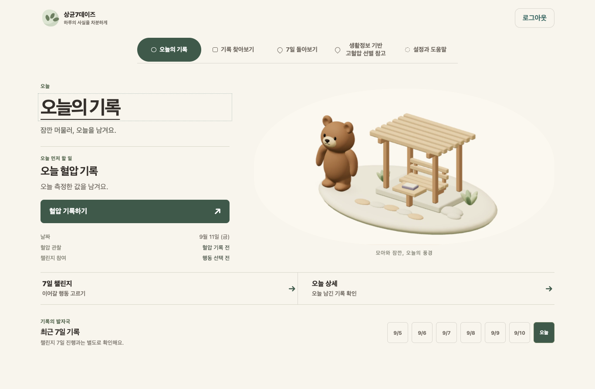

# 상균7데이즈 (SK7)

> **개발·문서 원본:** `AI-HealthCare-05/AH_05_07`
>
> `emotigom/ah-05-07-pages`의 파일은 배포용 동기화 사본입니다. 수정은 원본에서만 합니다.
> 개발 절차는 [AGENTS.md](AGENTS.md), 시작 맥락은 [짧은 인계](docs/project-handoff.md#fast-start),
> 운영 판단은 [배포 SSOT](docs/deployment-ssot.md)를 따릅니다. `main` 병합, 미러 동기화,
> 운영 배포, scene 활성화는 서로 다른 단계입니다.

**상균7데이즈**는 생활정보 입력, 아침·저녁 혈압 관찰, 한 가지 생활습관 챌린지를
7일의 흐름으로 연결하되 서로 다른 사실로 유지하는 비진단형 웹 서비스입니다.

- **운영 서비스:** [https://hyeol.app/](https://hyeol.app/)
- **같은 Worker의 운영 점검·롤백용 fallback:**
  [https://ah-05-07-pages.ahnsangkyoon.workers.dev/](https://ah-05-07-pages.ahnsangkyoon.workers.dev/)



_합성 fixture로 캡처한 SK7 Living Journey 화면입니다._

## 현재 제공 범위

| 영역 | 제공하는 경험 |
| --- | --- |
| 로그인 | 비밀번호 없이 Supabase 이메일 링크로 로그인하고, 유효한 브라우저 세션을 새로고침 뒤 복구합니다. |
| 혈압 관찰 | 측정 전 체크리스트를 확인하고 아침·저녁 관찰값을 작성·조회·수정·삭제합니다. |
| 7일 챌린지 | 걷기·수면 루틴·저염 식사 중 하나를 선택하고 매일 `완료` 또는 `건너뜀`을 기록합니다. 첫 체크인 뒤에는 행동 선택이 고정됩니다. |
| 기록과 회고 | 오늘, 기록 찾아보기, 현재·이전 7일 회고를 오가며 본인 기록을 확인하고 최근 7일 범위를 JSON으로 내보냅니다. |
| 생활정보 입력 | 생활정보를 동결된 11개 의미 특성 계약에 맞춰 Model V2 경로에서 처리합니다. 개인별 점수·확률·백분율·등급은 표시하지 않고, 입력과 내부 결과도 저장하지 않습니다. |
| 데이터 관리 | PostgreSQL RLS로 소유권을 제한하고, 제품 기록은 30일 뒤 접근을 차단한 다음 매일 물리 삭제합니다. 설정에서 2단계 확인 후 계정을 삭제할 수 있습니다. |

화면은 semantic HTML을 기본으로 동작합니다. 정적 clay poster와 선택적으로 로드되는
Three.js companion은 표현 계층일 뿐, 기록·인증·모델 의미를 바꾸지 않습니다.

## 안전 및 제품 계약

> [!IMPORTANT]
> 이 서비스는 교육·연구 목적의 데모이며 제품 기능에는 **합성 데이터만** 입력합니다.
> 로그인 이메일은 Supabase Auth에서만 관리하고 제품 기록에 복제하지 않습니다. 실제 임상 기록,
> 이름, 추가 연락처, 자유 서술 병력, 원본 문서 또는 인증정보를 입력하지 마세요.

- 제품 용어는 **입력 기반 위험군 선별 신호**로 고정합니다.
- 모델 처리, 측정한 혈압, 챌린지 참여는 서로 다른 사실이며 인과관계나 개선 효과로 합치지 않습니다.
- 개인별 점수·확률·백분율·등급을 공개하지 않습니다.
- 진단·처방·치료·예방 또는 응급 판단을 제공하지 않습니다.
- Model V2 입력과 내부 결과는 일시적으로만 처리하며 저장하거나 혈압·챌린지 기록과 결합하지 않습니다.

세부 계약은 [Model V2 제품 경계](docs/model-v2-product-contract.md),
[관찰 데이터 수명주기](docs/observation-data-lifecycle.md),
[인증 계약](docs/auth-contract.md)에서 확인할 수 있습니다.

## 아키텍처

| 계층 | 현재 구성 |
| --- | --- |
| Web | React, TypeScript, Vite, semantic HTML, 선택적 Three.js를 Cloudflare Worker `ah-05-07-pages`에서 제공합니다. |
| API | FastAPI를 서울 리전의 Google Cloud Run 서비스 `bp7-api`에서 실행합니다. |
| Auth · Data | Supabase Auth 이메일 링크와 Supabase PostgreSQL RLS가 세션·행 소유권 경계를 담당합니다. |
| Model V2 | 동결된 scikit-learn 아티팩트를 API에서 일시적으로 실행하고 승인된 비수치 응답만 투영합니다. |
| Visual assets | 승인된 공개 companion·poster 자산만 Cloudflare R2에서 불변 manifest와 함께 제공합니다. 앱 배포 경계와는 분리됩니다. |

자세한 구성과 ERD는 [Architecture](docs/architecture.md), 실제 운영 토폴로지와 최신 기록은
[Deployment SSOT](docs/deployment-ssot.md)를 기준으로 합니다.

## 로컬 web 실행

CI 기준 Node.js 버전은 24입니다.

```bash
cd web
cp .env.example .env.local
npm ci
npm run dev
```

`.env.local`의 `VITE_API_BASE_URL`, `VITE_SUPABASE_URL`,
`VITE_SUPABASE_PUBLISHABLE_KEY`를 로컬 환경에 맞게 설정합니다. `VITE_*` 값은 브라우저에
포함되는 공개 설정이므로 서버 전용 secret이나 Supabase secret/service-role key를 넣지 않습니다.
추가 preview와 합성 browser harness는 [web/README.md](web/README.md)를 참고합니다.

## 검증

개발 중에는 변경한 경계에 가장 가까운 검사만 반복합니다. 최종 PR에서는 필수 `lint`와
`test`를 통과해야 하며, web·scene·model 전용 검사는 변경 경로에 따라 추가됩니다.
아래 명령은 전체/수동 검증 예시이며, routine 변경에는 [AGENTS.md](AGENTS.md)의
affected-check 정책이 우선합니다.

```bash
# Python 전체 검증
uv sync --group app --group ai --frozen
uv run ruff check .
uv run ruff format . --check
uv run coverage run -m pytest app tests
uv run coverage report -m

# Web 설치와 production build
cd web
npm ci
npm run build
```

## 문서 안내

시작할 때 아래 문서를 모두 읽지 않습니다. 현재 작업의 경계에 해당하는 문서만 선택합니다.

| 목적 | 문서 |
| --- | --- |
| 개발 시작과 위험 기반 절차 | [AGENTS.md](AGENTS.md) · [Project handoff](docs/project-handoff.md#fast-start) |
| 제품과 Model V2 경계 | [Requirements](docs/requirements.md) · [Model V2 product contract](docs/model-v2-product-contract.md) |
| 시스템·데이터·API | [Architecture and ERD](docs/architecture.md) · [Data contract](docs/data-contract.md) · [API contract](docs/api-contract.md) |
| 사용자 여정과 시각 계층 | [UX flow](docs/ux-flow.md) · [Visual production contract](docs/visual-production-contract.md) · [Scene architecture](docs/scene-architecture.md) |
| 자산 | [Asset register](docs/asset-register.md) · [Companion runtime](docs/companion-runtime.md) |
| 배포와 운영 | [Deployment SSOT](docs/deployment-ssot.md) · [Release contract](docs/architecture/RELEASE_CONTRACT.md) |
