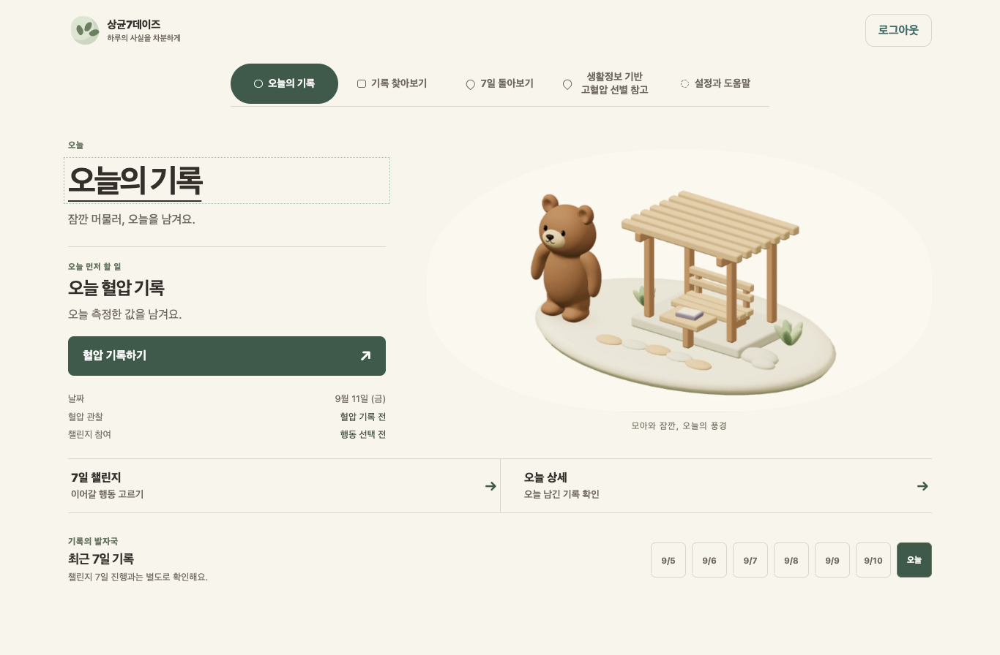
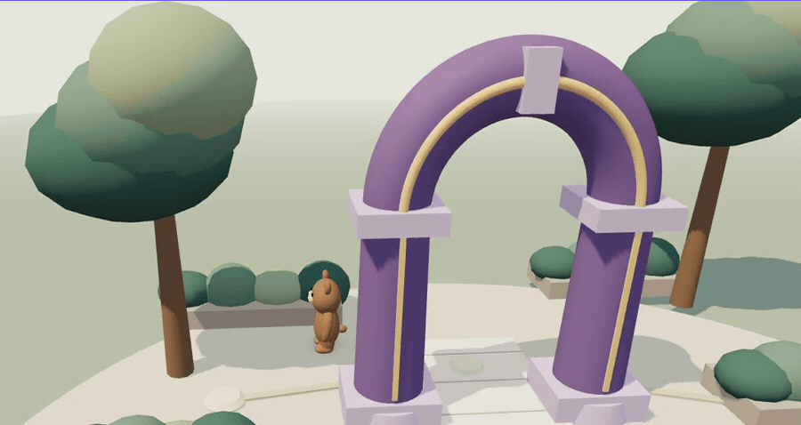
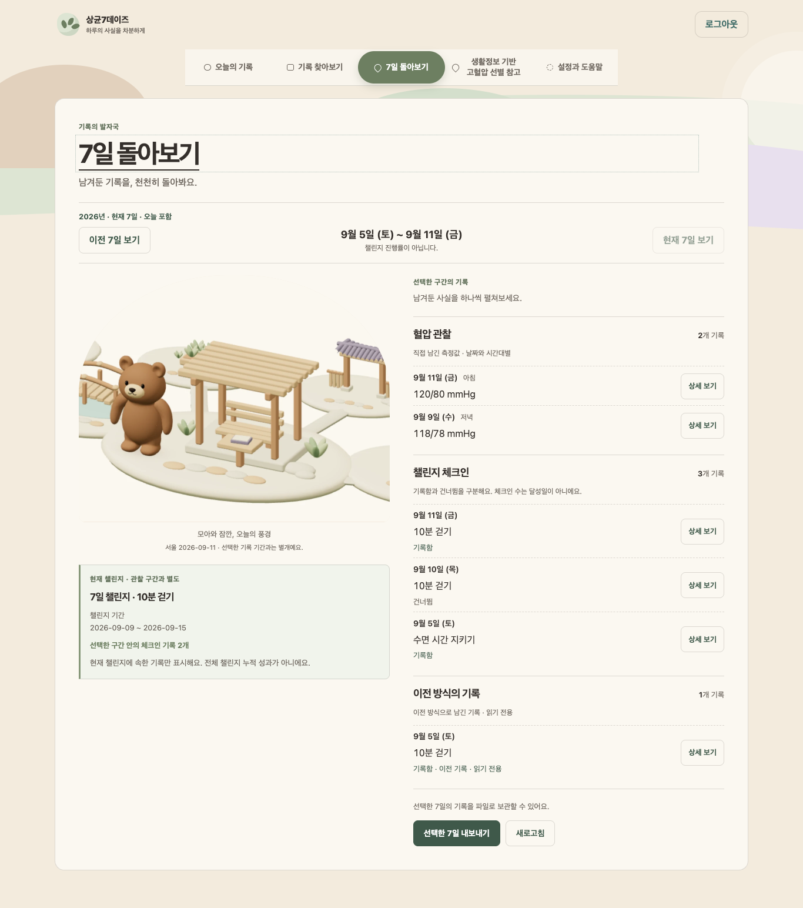
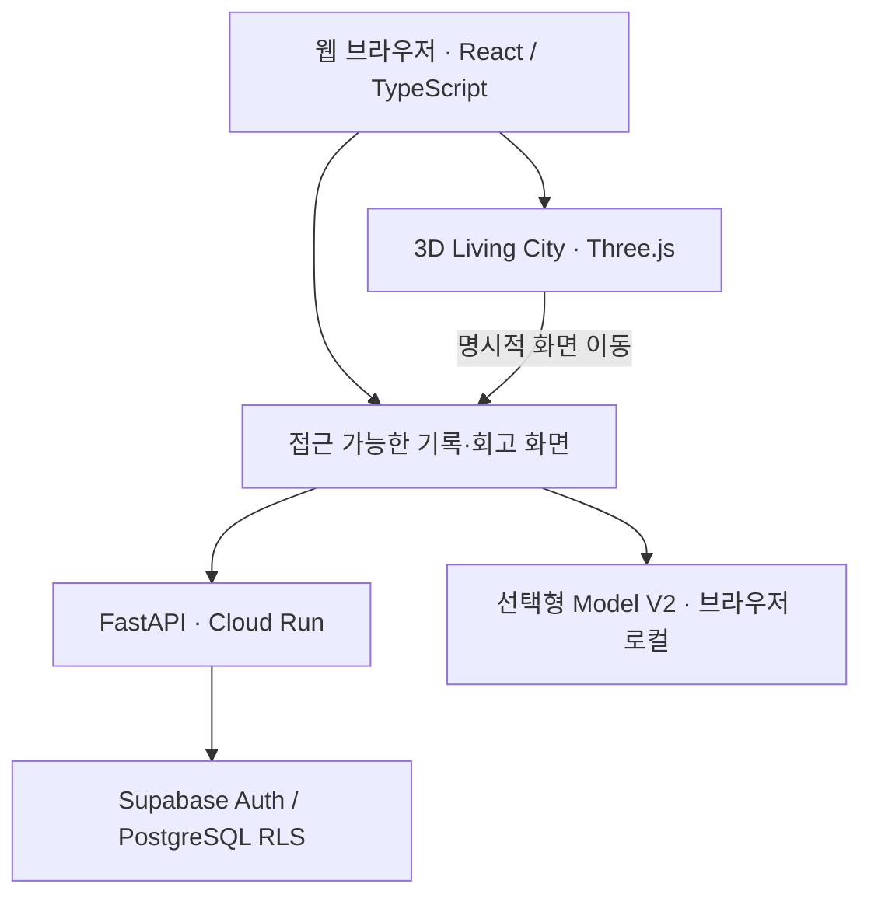

<!-- SK7 public repository · README visual redesign candidate · 2026-10-09 -->

<div align="center">

# SK7 · 상균7데이즈

**오늘의 혈압 관찰을 기록하고, 최근 7일을 돌아보는 공간.**

혈압 관찰 · 7일 생활습관 챌린지 · 선택형 생활정보 참고 도구를 각각 구분해 제공하는 **비진단형 웹 서비스**입니다.

[서비스 열기](https://hyeol.app/) · [3D Living City 설계](docs/architecture/SK7_LIVING_CITY_3D_FIRST_PRODUCT_CONTRACT.md) · [시작하기](#로컬-실행) · [이용 조건](LICENSE.md)

</div>

<p align="center">
  <picture>
    <source media="(max-width: 600px)" srcset="web/public/assets/moa-journey-map-v1-mobile.webp">
    
  </picture>
</p>

<p align="center"><sub>SK7 저장소의 7일 여정 정적 시각 자산입니다. 실제 3D Living City 런타임을 녹화한 영상은 아닙니다.</sub></p>

---

## 경험 소개

SK7은 측정값을 평가하거나 건강 결과를 약속하지 않습니다. **기록할 일은 명확하게, 공간을 경험할 시간은 편안하게** 분리합니다.

### 01 · 오늘의 기록

날짜와 아침·저녁 시간대에 따라 혈압 관찰값을 직접 남기고, 작성·조회·수정·삭제할 수 있습니다. 중요한 입력과 사실은 이미지 또는 3D 연출과 별개로 접근 가능한 화면에서 제공합니다.



<sub>이 화면은 합성 fixture를 사용한 이전 UI 검증 캡처입니다. 최신 운영 화면과 동일하다는 뜻은 아닙니다.</sub>

### 02 · 나만의 공간, Living City

모아와 공간을 탐색하는 **Three.js 기반 Living City**는 기록 화면과 역할이 다릅니다. 3D 공간은 이동·탐색과 화면 전환 의도를 담당하며, 실제 관찰값·계정·모델 결과를 임의로 읽거나 판단하지 않습니다.

현재 [3D-first 제품 계약](docs/architecture/SK7_LIVING_CITY_3D_FIRST_PRODUCT_CONTRACT.md)은 3D 세계와 **직접 접근 가능한 기존 화면**을 동등한 경로로 정의합니다. WebGL 실패, 모션 감소 설정, 키보드·접근성 요구가 있어도 중요한 작업을 계속할 수 있도록 설계합니다. 3D 노출 범위는 환경과 배포 단계에 따라 달라질 수 있습니다.

<p align="center">
  <picture>
    <source media="(prefers-reduced-motion: reduce) and (max-width: 600px)" srcset="docs/media/readme/living-city-mobile-still.png">
    <source media="(prefers-reduced-motion: reduce)" srcset="docs/media/readme/living-city-desktop-still.png">
    <source media="(max-width: 600px)" srcset="docs/media/readme/living-city-mobile.gif">
    
  </picture>
</p>

<sub>실제 SK7 Three.js 비로그인 체험을 합성 데이터 환경에서 촬영해 짧은 구간을 왕복 반복 편집한 GIF입니다. 실제 건강정보·계정정보는 포함하지 않으며, 운영 환경의 3D 활성화 상태를 입증하지 않습니다. 동작 감소 설정에서는 정적 이미지를 제공합니다.</sub>

[일시정지가 가능한 데스크톱 영상](docs/media/readme/living-city-desktop.mp4) · [모바일 영상](docs/media/readme/living-city-mobile.mp4) · [기존 장면 포스터](web/public/scene-review/s10/v1/garden-gate-desktop-838960a55a32089a.webp)

### 03 · 7일의 흐름과 회고

최근 7일의 관찰 기록을 날짜별로 다시 확인하고, 인쇄 또는 PDF, JSON 형태로 내보낼 수 있습니다. 생활습관 챌린지의 참여 사실은 측정값 또는 생활정보 모델 결과와 결합하지 않습니다.



<sub>합성 fixture를 사용한 이전 UI 검증 캡처이며, 최신 화면의 실시간 스크린샷은 아닙니다.</sub>

---

## 핵심 기능

| 영역 | 사용자가 할 수 있는 일 |
| --- | --- |
| 로그인 | Supabase 이메일 링크로 로그인하고 브라우저 세션을 복구합니다. |
| 혈압 관찰 | 아침·저녁 관찰값을 작성·조회·수정·삭제합니다. |
| 생활습관 챌린지 | 걷기·수면 루틴·저염 식사 중 하나를 선택해 `완료` 또는 `건너뜀`으로 참여를 기록합니다. |
| 기록 및 회고 | 오늘과 이전 기록을 확인하고, 7일 회고를 인쇄·PDF 또는 JSON으로 내보냅니다. |
| 선택형 생활정보 도구 | 11개 의미 특성 계약에 따라 브라우저 안에서 입력 기반 위험군 선별 신호를 참고합니다. 진단·확률·등급으로 해석하지 않습니다. |
| 데이터 관리 | 행 단위 접근 통제, 30일 기록 수명주기, 2단계 확인을 통한 계정 삭제를 지원합니다. |

## 어떻게 구성되어 있나요?


```mermaid
flowchart TD
    A["웹 브라우저 · React / TypeScript"]
    B["3D Living City · Three.js"]
    C["접근 가능한 기록·회고 화면"]
    D["FastAPI · Cloud Run"]
    E["Supabase Auth / PostgreSQL RLS"]
    F["선택형 Model V2 · 브라우저 로컬"]

    A --> B
    A --> C
    B -->|"명시적 화면 이동"| C
    C --> D
    D --> E
    C --> F
```

**경계:** 3D 공간은 의료정보 판단이나 데이터 접근 권한을 갖지 않습니다. Model V2의 한시적 연구·개발 미리보기와 출력 의미는 [현재 제품 계약](docs/model-v2-product-contract.md#current-authority)을 따릅니다. 전체 구조는 [Architecture](docs/architecture.md)에서 확인할 수 있습니다.

## 안전과 한계

> [!IMPORTANT]
> **SK7은 교육·연구 목적의 비진단형 데모입니다. 제품 기능에는 합성 데이터만 입력하세요.**
> 실제 임상 기록, 이름, 추가 연락처, 자유 서술 병력, 원본 문서 또는 인증정보는 입력하지 마세요.

- 관찰한 혈압, 챌린지 참여, 선택형 모델 참고 결과는 **서로 다른 사실**입니다. 인과관계나 건강 개선 효과를 주장하지 않습니다.
- 진단, 처방, 치료, 예방 또는 응급 판단을 제공하지 않습니다.
- 개인별 확률·백분율·등급으로 해석하지 않습니다. 한시적 연구·개발 미리보기의 연속 출력도 이러한 의미를 갖지 않습니다.
- 인증·세션·RLS, 데이터 보존 및 삭제의 구체적인 안전 규칙은 [Auth 계약](docs/auth-contract.md), [관찰 데이터 수명주기](docs/observation-data-lifecycle.md), [Model V2 제품 계약](docs/model-v2-product-contract.md)을 따릅니다.

## 로컬 실행

CI 기준 Node.js 버전은 **24**입니다.

```bash
cd web
cp .env.example .env.local
npm ci
npm run dev
```

`.env.local`에 `VITE_API_BASE_URL`, `VITE_SUPABASE_URL`, `VITE_SUPABASE_PUBLISHABLE_KEY`를 환경에 맞게 설정합니다. `VITE_*` 변수는 브라우저에 포함되므로 서비스 전용 secret 또는 Supabase service-role 키를 절대로 넣지 않습니다. [웹 실행 및 테스트 안내](web/README.md)를 참고하세요.

## 개발과 검증

- **Web:** React, TypeScript, Vite, Three.js, Cloudflare Worker
- **API:** FastAPI, Google Cloud Run
- **인증·저장:** Supabase Auth, PostgreSQL RLS
- **선택형 AI:** 동결된 11개 특성 계약을 따르는 브라우저 로컬 Model V2
- **CI:** 변경 범위 기반의 `lint`, `test`와 관련 단계별 검사

작업은 [AGENTS.md](AGENTS.md)와 GitHub Issue/PR을 기준으로 수행합니다. 영향 범위에 맞는 검사를 선택하며, 실제 `main` 병합, 배포 미러 동기화, Cloudflare 배포, 3D 장면 활성화는 각각 **별도의 단계**입니다. 자세한 자료는 [문서 색인](docs/README.md)과 [배포 가이드](docs/deployment.md)를 참고하세요.

> 개발·문서 원본은 **`AI-HealthCare-05/AH_05_07`**입니다. `emotigom/ah-05-07-pages`는 배포용 비공개 동기화 사본이며 원본 수정 위치가 아닙니다.

## 저작권 및 이용 조건

본 저장소는 공개되어 있으나 **오픈소스 이용허락을 제공하지 않습니다.** 원저작물의 재사용·수정·재배포·재호스팅·상업적 이용에는 해당 권리자의 별도 허락이 필요합니다. GitHub 약관에 따라 허용되는 열람·포크, 법률상 허용되는 이용, 기존 서면 동의·계약 및 제3자 자료의 개별 라이선스는 영향을 받지 않습니다.

자세한 내용은 [LICENSE.md](LICENSE.md)를 확인하세요.
