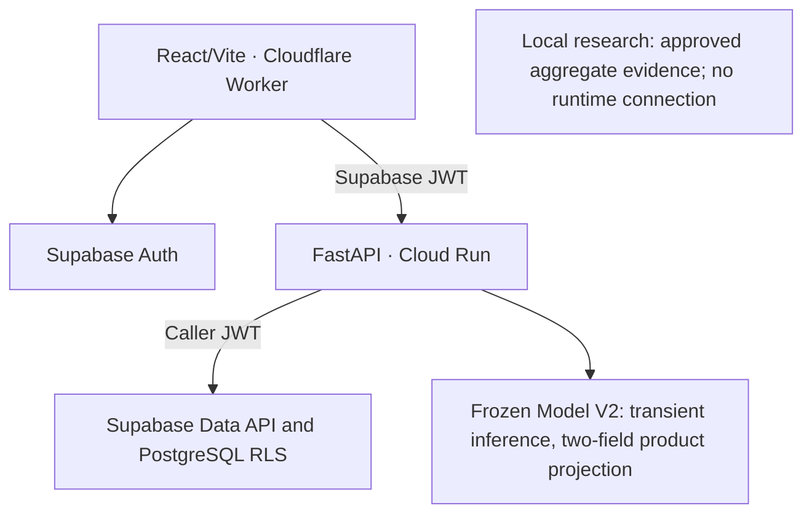
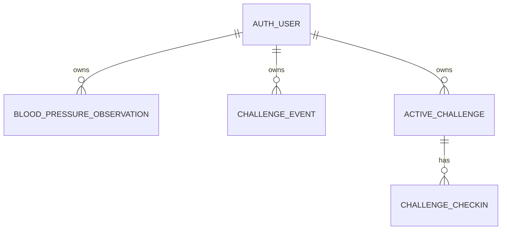
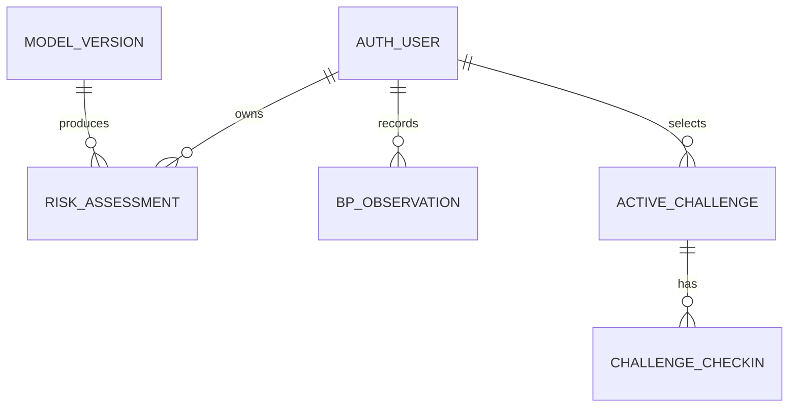
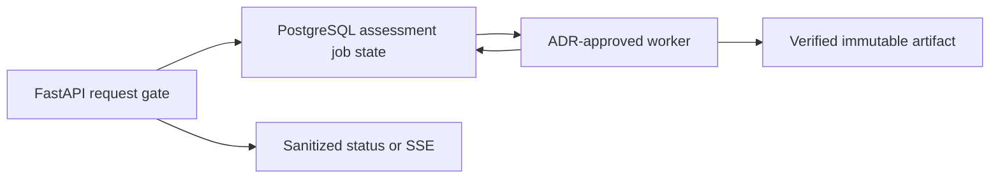

# Architecture and ERD

## Decision

React/Vite static assets run on the Cloudflare Worker `ah-05-07-pages`. The browser uses Supabase Auth email magic links and sends its Supabase JWT to FastAPI on the Cloud Run service `bp7-api` in Seoul. FastAPI performs record operations through the caller's JWT, while Supabase PostgreSQL RLS remains the ownership boundary.

Authenticated Model V2 production paths now exist. `/api/v1/model-v2/product-score` is connected to S11 and projects only `schema_version` and `product_wording`; its internal numeric inference result is transient, not persisted, and not exposed. Raw Model V2 product input and result are not stored. The frozen Model V2 contract is canonical in [architecture invariants](architecture/ARCHITECTURE_INVARIANTS.md). The legacy `/api/v1/risk-signal` scaffold remains separately unavailable. Redis, a separate application worker, OCR, and an LLM remain deferred until an ADR and measurement demonstrate a requirement.

[Submission architecture SVG](diagrams/mvp1-architecture.svg) and [ERD SVG](diagrams/mvp1-erd.svg) distinguish the current source implementation from unimplemented targets. [MVP1 closeout](mvp1-closeout.md) owns requirement gaps and client acceptance; an internal target is not client approval of reduced scope.

## Talos scope reconciliation (Uponati excluded)

| Talos evaluation axis | SK7 status | Accepted next boundary |
|---|---|---|
| Public-data model and result quality | Frozen Model V2 S11 product path returns only `schema_version` and `product_wording`; legacy risk-signal remains a `503 model_not_ready` scaffold. | Preserve frozen artifact, exact response projection, and non-diagnostic semantics; no provisional score is permitted. |
| Chronic-condition tracking dashboard | BP and challenge records are separated, but the evaluator-facing seven-day trend, empty/failure states, and evidence pack remain partial. | Present measurement, challenge adherence, and model signal as separate facts; do not render a causal or improvement conclusion. |
| Lifestyle challenge | Active seven-day challenge, first-check-in action lock, and status-only check-in changes are implemented. | Finish signed-in browser and mobile evidence before treating the flow as submission-complete. |
| Feedback and reminders | Structured feedback is planned; reminders are not implemented. | Feedback stays separate from online-training labels. Reminders are P2 only after P0 evidence is complete. |
| Heavy AI processing | No measured model workload currently justifies a queue or worker. | Use the conditional asynchronous boundary below only after an ADR and measured trigger. Uponati-only OCR, prescription, medical-document, and LLM guidance are outside SK7 scope. |

## Current persisted model

The current migrations create `blood_pressure_observations`, legacy `challenge_events`, `active_challenges`, and `challenge_checkins`. The new challenge tables:

- reference `auth.users(id)` and carry the same `user_id` into each check-in;
- enable RLS and require `auth.uid() = user_id` for reads and writes;
- permit one `active` challenge per user with a partial unique index;
- enforce a seven-day window and same-user in-window check-ins with database constraints and triggers;
- make the selected action immutable after the first check-in;
- become inaccessible at `expires_at` after 30 days through RLS; a scheduled PostgreSQL job later purges the expired rows physically.

The observation and legacy-event tables:

- reference `auth.users(id)` with `ON DELETE CASCADE`;
- enable RLS and require `auth.uid() = user_id` for reads and writes;
- become inaccessible at `expires_at` after 30 days through RLS; a scheduled PostgreSQL job later purges the expired rows physically;
- store structured values only.

`challenge_events` remains readable as a legacy daily-event record until its existing 30-day retention period ends. It is not used to establish an active challenge.

## Historical target domain model — obsolete/non-current planning

The active-challenge portion of the target diagram is now implemented by the reviewed migration. This retained planning diagram is not applicable to the frozen Model V2 product contract: Model V2 does not persist a risk assessment, probability, band, or model-version record.

## Component status

| Component | Current status | Next contract |
|---|---|---|
| Cloudflare web | Implemented; production history exists | Verify the current release and owner/failure flows under the closeout operations plan. |
| Supabase Auth | Production | Keep email magic links and publishable browser key. |
| Observation API | Production core | Preserve owned BP update/delete and bounded export; allow status-only current-check-in update and explicit-confirmation delete without changing the challenge action, date, or owner. |
| Observation tables | Production | Preserve RLS, ownership indexes, uniqueness, exact-time access expiry, and 30-day physical retention. |
| Challenge domain | Implemented as separate active challenge and check-ins | Complete current-release owner edit/delete and recovery evidence. |
| Model V2 product API | S11 production path | Authenticated `/api/v1/model-v2/product-score` projects only schema version and approved wording; inference remains transient. |
| Legacy risk-signal API | Scaffold | Remains unavailable; it is not the Model V2 product surface. |
| Health endpoints | Implemented | `/live` checks process liveness; `/ready` checks only that required runtime configuration is present and reveals no configuration or record data. |
| Structured feedback | P1 planned | Store review input separately; never use it for online retraining. |

## Conditional asynchronous assessment boundary (not implemented)

This is a decision boundary for a future distinct assessment architecture, not an
implementation commitment and not the current frozen Model V2 product path. It
does not apply to frozen Model V2: current Model V2 input and result remain
transient and non-persistent. An ADR alone cannot authorize persistence that
violates the frozen Model V2 invariants. Any future distinct assessment
architecture that requires persistence must first receive a separate explicit
product/data contract approval outside the frozen Model V2 boundary. Only then,
if a verified-model request or offline training requires background processing,
may the API persist a minimal job record before returning a status reference.
An ephemeral queue by itself is not a source of truth.

The ADR must define the measured trigger, state transitions, idempotency key, retry and timeout policy, result retention, authorization, and failure behavior. It must also show why synchronous verified CPU inference is insufficient. No Redis, worker, status endpoint, SSE channel, or new table may be presented as implemented before the separate product/data contract, that ADR, and the matching executable contract are approved and merged. None of those approvals authorize persistence or other changes inside the frozen Model V2 boundary.

## Data classification

| Class | Examples | Storage rule |
|---|---|---|
| Product record | BP observation, challenge selection, challenge check-in | Supabase structured tables with JWT, RLS, retention, and deletion. |
| Model V2 transient fact | Internal inference result and product input | Do not persist or expose raw input, result, probability, score, or band. |
| Public asset | Tutorial image, synthetic demo video, licensed audio | Cloudflare R2 with provenance and lifecycle metadata. |
| Forbidden | Name, contact, free-text history, original document, device export, JWT, service-role key | Do not collect or place in product tables, R2, logs, demos, or Git. |

Feedback remains review data rather than a training label. BP readings and BP-derived aggregates that define the label remain excluded from model predictors. A future distinct assessment architecture outside the frozen Model V2 boundary must persist its approved state and result in PostgreSQL; an ephemeral queue alone is insufficient.
