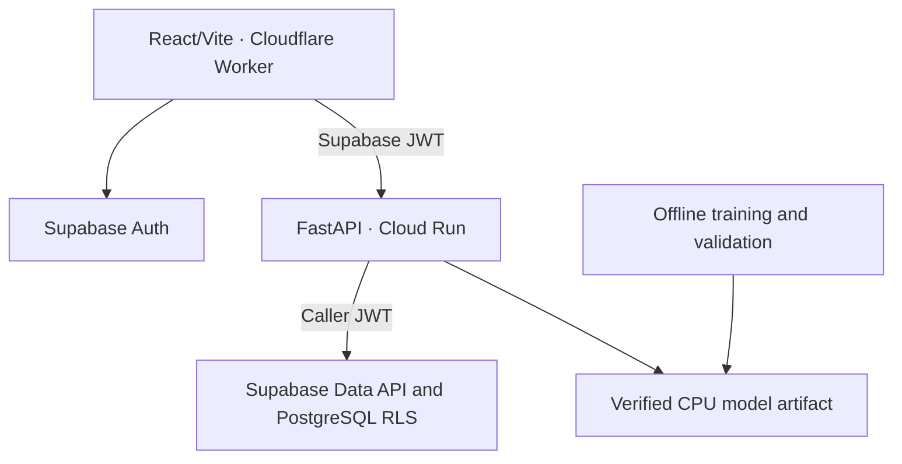
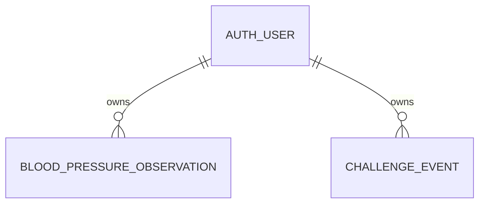
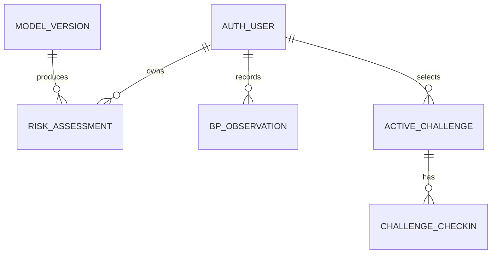

# Architecture and ERD

## Decision

React/Vite static assets run on the Cloudflare Worker `ah-05-07-pages`. The browser uses Supabase Auth email magic links and sends its Supabase JWT to FastAPI on the Cloud Run service `bp7-api` in Seoul. FastAPI performs record operations through the caller's JWT, while Supabase PostgreSQL RLS remains the ownership boundary.

The API may load an immutable CPU model artifact only after its metadata and split digest pass verification. Redis, a separate application worker, OCR, and an LLM remain deferred until an ADR and measurement demonstrate a requirement.

## Current persisted model

The current migration creates `blood_pressure_observations` and `challenge_events`. Both tables:

- reference `auth.users(id)` with `ON DELETE CASCADE`;
- enable RLS and require `auth.uid() = user_id` for reads and writes;
- expire after 30 days and are purged by a scheduled PostgreSQL job;
- store structured values only.

The current `challenge_events` table represents daily action events. It does not yet represent the accepted product concept of one active seven-day challenge.

## Accepted target domain model

Names in the target diagram are conceptual until a migration is reviewed. A future migration must preserve existing ownership and retention guarantees and must not be inferred from the diagram alone.

## Component status

| Component | Current status | Next contract |
|---|---|---|
| Cloudflare web | Production | Add the accepted P0 flow and failure states. |
| Supabase Auth | Production | Keep email magic links and publishable browser key. |
| Observation API | Production core | Add update and connect delete/export controls. |
| Observation tables | Production | Preserve RLS, ownership indexes, uniqueness, and 30-day retention. |
| Challenge domain | Partial | Separate active challenge from daily check-ins. |
| Risk-signal API | Scaffold | Release only with verified artifact and deterministic evidence. |
| Health endpoints | Planned | Separate liveness from dependency readiness. |
| Structured feedback | P1 planned | Store review input separately; never use it for online retraining. |

## Data classification

| Class | Examples | Storage rule |
|---|---|---|
| Product record | BP observation, challenge selection, challenge check-in | Supabase structured tables with JWT, RLS, retention, and deletion. |
| Model fact | Model version, probability, band, input completeness | Versioned assessment record; separate from measurements and adherence. |
| Public asset | Tutorial image, synthetic demo video, licensed audio | Cloudflare R2 with provenance and lifecycle metadata. |
| Forbidden | Name, contact, free-text history, original document, device export, JWT, service-role key | Do not collect or place in product tables, R2, logs, demos, or Git. |

Feedback remains review data rather than a training label. BP readings and BP-derived aggregates that define the label remain excluded from model predictors. A future asynchronous job must persist state and result in PostgreSQL; an ephemeral queue alone is insufficient.
