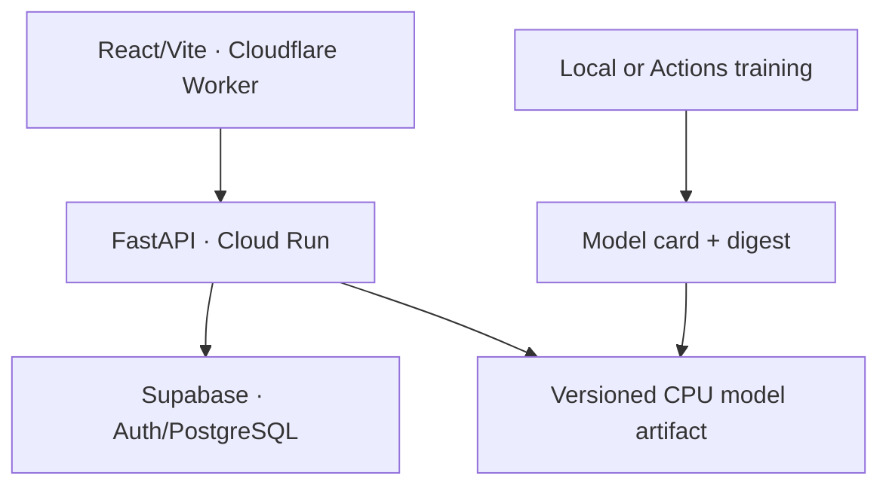
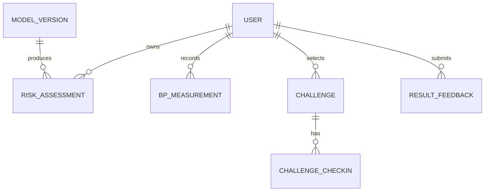

# Architecture and ERD

## Decision

React/Vite runs as static assets on a Cloudflare Worker. FastAPI inference runs on Cloud Run Seoul. Supabase Auth/PostgreSQL runs in Seoul. The API image loads an immutable CPU model artifact. Redis, a separate worker, and an LLM remain deferred until a benchmark demonstrates that a batch task violates the request contract.

Persist only structured values required by the contract. No uploaded documents, medication records, free text, contacts, or raw device files. Feedback is review data, not a training label. A later asynchronous job must persist state and result in PostgreSQL; Pub/Sub alone is insufficient.
