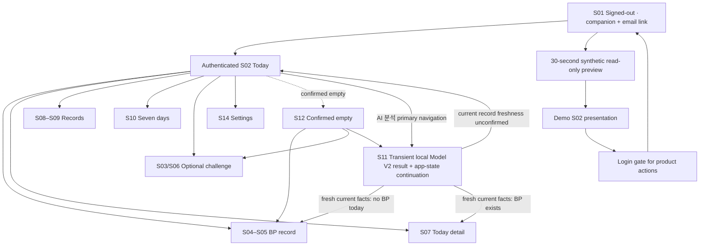
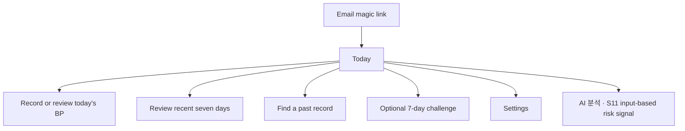

# UX flow

## Current application flow

Issue #190 introduced the Calm Clay Journey application shell and semantic
screens S01–S14. The current web supports authentication, a concise
pre-measurement checklist, BP creation, edit, explicit-confirmation delete,
bounded seven-day JSON export, one optional active challenge selection, daily
check-ins, status-only check-in edit, explicit-confirmation check-in delete, and
separated review screens. The first challenge check-in locks the chosen action.

S01 also presents the 11-species decorative companion selector and narrator. The
non-medical preference is stored only as `sk7-companion-species`. The signed-out
`로그인 없이 30초 맛보기` path carries that preference into a synthetic,
read-only Demo S02 presentation without creating an account/session, opening an
API/DB write path, or persisting demo progress. Product actions from the preview
are intercepted by a login gate. The preview is presentation-only and is never
treated as authenticated product history.

The signed-in screen state is reflected by a safe `screen` URL parameter. The
five primary destinations are `오늘의 기록`, `AI 분석`, `기록 찾아보기`,
`7일 돌아보기`, and `설정` (mobile: `오늘`, `AI`, `기록`, `7일`, `설정`).
S11 owns the AI navigation state and is one primary-navigation action away from
any signed-in primary screen; S14 owns Settings only, with no duplicate AI entry.
S02's contextual `오늘의 시작점` entry and S12's optional lifestyle entry remain.
The discoverability label `AI 분석` does not expand the S11 meaning of
`입력 기반 위험군 선별 신호`: browser-local computation, the temporary research
preview, interpretation prohibitions, non-persistence, and expiry remain governed
by the [Model V2 product contract](model-v2-product-contract.md).
Direct S11 URLs, authentication boundaries, and browser back/forward remain valid.
Focused work screens remain reachable without introducing a router dependency.

| Screen | Purpose |
|---|---|
| S01 | Signed-out companion narrator/selector, email-link gate, and synthetic read-only preview entry |
| S02 | Today home; BP state determines the lead action |
| S03 | Optional challenge choice |
| S04–S05 | BP entry and confirmed new-save; successful edits return to their record detail |
| S06 | Optional challenge state |
| S07 | Today detail with separate BP/challenge/legacy fact lanes |
| S08–S09 | Record browse, accumulated-record overview, and one selected record with its date/period context |
| S10 | Current/prior seven-day recap, partial-record coverage, human-readable report/PDF, and export |
| S11 | Primary `AI 분석` capability with an optional browser-local Model V2 result, transient `오늘의 시작점` lifestyle summary, and one app-state continuation; input, result and continuation are not persisted |
| S12–S13 | Confirmed empty and initial-load failure; current S12 keeps BP recording primary while exposing S11 as a lower-priority optional path |
| S14 | Settings: account and retention/help |

## Accepted P0 flow

The core path is BP-first, but the product still preserves three separate facts:

1. The user records measured blood-pressure observations.
2. The user may separately record adherence to one selected challenge.
3. The optional model tool processes an **입력 기반 위험군 선별 신호** without
   becoming a prerequisite for BP recording, challenge use, record browsing, or export.

For a confirmed current empty window, S12 keeps blood-pressure recording as the
primary action and exposes S11 only as a secondary option. S11 shows the transient
browser-local Model V2 result under the [current visibility contract](model-v2-product-contract.md),
then summarizes the entered activity, sleep, and lifestyle facts as `오늘의 시작점`.
Its “다음 한 걸음” presents one primary action before the separate BP/challenge
status context. These routes use stored/current app state, never Model V2 output
or survey answers:

- Unconfirmed current-record freshness (including retained refreshing/refresh-error
  data or a prior-window view): S02 to confirm today's state first.
- Fresh current facts with no BP today: S04 to record a measured value, regardless
  of challenge state.
- BP exists and an active challenge has no check-in today: S07 for the existing
  `기록함 / 건너뜀` controls.
- Other confirmed states with BP: S07 to review today's records. Both `completed`
  and `skipped` count as recorded; a missing or ended challenge does not force
  challenge selection or permit an ended-challenge check-in.

The secondary Today action remains unless the primary already leads to S02.
Continuation also works outside the numeric preview window. No input, result or
continuation is persisted; leaving S11 discards the survey/result, and re-entry
starts a fresh survey.

The Today BP window is always today plus the previous six calendar dates. An
active challenge has its own start/end dates and never changes the Home BP
window or the Home lead action. Morning/evening are displayed as recorded
periods; the UI does not turn two measurements per day into a completion rule.

The dashboard never merges model output, BP, and challenge participation into a
diagnosis, treatment effect, prevention claim, or single improvement score.

## Record review contract

Record review is a continuation of the BP-first journey rather than a separate
analytics product.

- S08 summarizes how many records and recorded dates exist in the selected
  seven-day window, while preserving BP, challenge check-ins, and legacy records
  as separate record types.
- S09 identifies the selected record's date and, for BP observations, its
  morning/evening period. Opening a detail from S10 returns to S10; opening it
  from S08 returns to S08.
- S10 shows recorded and unrecorded dates without treating an empty date as a
  lost record or as proof that no measurement occurred.
- The seven-day report explicitly shows BP observation count, dates with BP
  observations, dates without BP observation records, and challenge participation
  separately. Morning/evening counts use the stored period selection, not a
  measured clock time. With two or more loaded observations, the report shows
  their simple arithmetic mean (equal weight per observation, no missing-date
  zeroes or daily-average weighting); only the display rounds to one decimal.
  Zero or one observation has no separate mean display. Date-ascending raw
  observations remain visible, morning before evening, and each check-in shows
  its own stored action and status even after a new challenge starts.
- The report remains a human-readable record summary for review, printing, or
  PDF saving; users may directly show their copy during a consultation. The
  scope is the displayed current or completed seven-day range of saved records
  currently loaded, not proof of measurement or of why a record is absent.
  It does not classify measurements or infer diagnosis, treatment effect,
  adherence success, or improvement. Print retains raw facts, scope, freshness
  warnings, and the non-diagnostic/user-managed-copy footer while hiding app
  controls and decorative landmark names. No new persistence, sharing service,
  or Model V2 data is involved.
- S05 is reserved for confirmed new saves and describes the fact that was
  actually saved. A past-dated BP save directs the user to record history
  instead of claiming it is today's record; a challenge check-in is described
  as a challenge fact rather than a BP save.
- A successful BP edit returns to S09 after the refreshed read instead of
  presenting the new-save S05 state. Cancel and successful edit therefore both
  preserve the record-detail history path without creating a Back loop.
- JSON exports and any PDF/printed copies created through the browser are
  user-managed copies outside the account's 30-day server retention.

## Signature presentation contract

The [visual production contract](visual-production-contract.md) defines the concern-specific authorities, canonical synthetic fixtures, responsive baselines, accessibility requirements, and G0–G4 approval evidence for this flow. On mobile, the stable order is today's context, measurement action, challenge action, then recap and history. A loading or failed request must not be rendered as a confirmed empty window.

## Measurement checklist contract

- The BP form shows the checklist before the date, period, and numeric fields.
- It briefly covers preparation, resting posture, cuff/arm position, and avoiding talking or phone use during the measurement.
- The guide is a consistency aid only: it is not stored, it does not block saving, and it does not classify a reading or offer diagnosis, treatment, prevention, or emergency guidance.
- The existing morning/evening selector remains the record's only time-related input; users are encouraged to record at a similar time when possible.

## Challenge contract

- The user selects one of walking, sleep routine, or low-sodium meal.
- The selection creates one active seven-day challenge.
- Each day records `completed` or `skipped` for that active challenge.
- During its current unexpired seven-day window, a check-in can change only between `completed` and `skipped`; its date, action, challenge link, and owner stay fixed.
- During that same window, a user may delete an owned check-in after an explicit confirmation. An active challenge itself is not deleted through the web flow.
- The challenge cannot be replaced after its first check-in.
- Completion is adherence history, not evidence that blood pressure improved.

## Recovery paths

| Situation | User-visible behavior |
|---|---|
| Expired email link | Offer a new magic link without implying an account problem. |
| Expired session | Clear the local session, ask the user to sign in again, and do not report an uncertain write as saved. |
| Duplicate BP period or challenge check-in | Update intentionally or show a clear conflict; never create silent duplicates. |
| Network or storage failure | State that saving was not confirmed, offer a fresh read, then let the user decide whether another write is needed. |
| Model artifact unavailable | Show a not-ready state with no provisional score. |
| Empty seven-day window | Show an intentional empty state and the next available action. |
| Unauthorized record ID | Return not found without revealing another user's data. |
