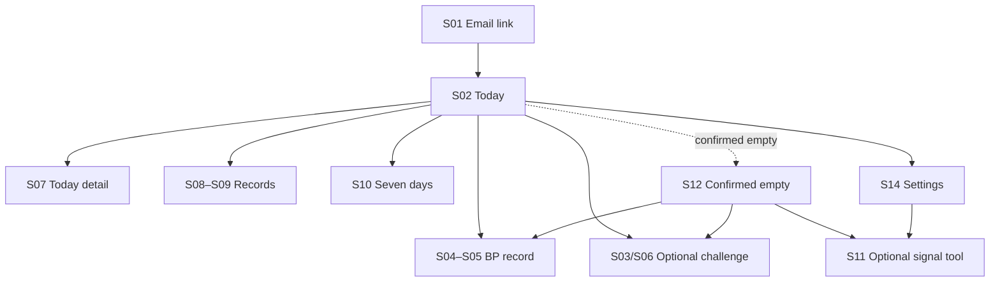
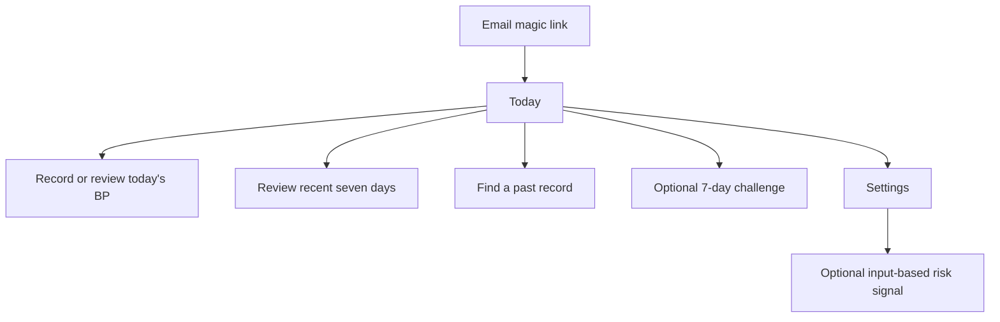

# UX flow

## Current application flow

Issue #190 introduced the Calm Clay Journey application shell and semantic
screens S01–S14. The current web supports authentication, a concise
pre-measurement checklist, BP creation, edit, explicit-confirmation delete,
bounded seven-day JSON export, one optional active challenge selection, daily
check-ins, status-only check-in edit, explicit-confirmation check-in delete, and
separated review screens. The first challenge check-in locks the chosen action.

The signed-in screen state is reflected by a safe `screen` URL parameter. The
four primary destinations are Today, Records, Seven days, and Settings. S11 is a
secondary tool reached from Settings and, when the current window is confirmed
empty, from S12 as a lower-priority non-persistent option. Direct S11 URLs,
authentication boundaries, and browser back/forward remain valid. Focused work
screens remain reachable without introducing a router dependency.

| Screen | Purpose |
|---|---|
| S01 | Signed-out email-link gate |
| S02 | Today home; BP state determines the lead action |
| S03 | Optional challenge choice |
| S04–S05 | BP entry and confirmed-save |
| S06 | Optional challenge state |
| S07 | Today detail with separate BP/challenge/legacy fact lanes |
| S08–S09 | Record browse, accumulated-record overview, and one selected record with its date/period context |
| S10 | Current/prior seven-day recap, partial-record coverage, human-readable report/PDF, and export |
| S11 | Optional input-based risk-signal tool; entered activity/sleep/lifestyle facts are summarized as a transient `오늘의 시작점`, without persisting the input or result |
| S12–S13 | Confirmed empty and initial-load failure; current S12 keeps BP recording primary while exposing S11 as a lower-priority optional path |
| S14 | Account, retention/help, and entry to optional tools |

## Accepted P0 flow

The core path is BP-first, but the product still preserves three separate facts:

1. The user records measured blood-pressure observations.
2. The user may separately record adherence to one selected challenge.
3. The optional model tool processes an **입력 기반 위험군 선별 신호** without
   becoming a prerequisite for BP recording, challenge use, record browsing, or export.

For a confirmed current empty window, S12 keeps blood-pressure recording as the
primary action and exposes S11 only as a secondary option. S11 summarizes the
entered activity, sleep, and lifestyle facts as a transient `오늘의 시작점`;
the input and result are not persisted.

The Today BP window is always today plus the previous six calendar dates. An
active challenge has its own start/end dates and never changes the Home BP
window or the Home lead action. Morning/evening are displayed as recorded
periods; the UI does not turn two measurements per day into a completion rule.

The dashboard never merges model output, BP, and challenge participation into a
diagnosis, treatment effect, prevention claim, or single improvement score.

## Record review contract

Record review is a continuation of the BP-first journey rather than a separate
analytics product.

- S08 summarizes how many records and recorded dates exist in the selected
  seven-day window, while preserving BP, challenge check-ins, and legacy records
  as separate record types.
- S09 identifies the selected record's date and, for BP observations, its
  morning/evening period. Opening a detail from S10 returns to S10; opening it
  from S08 returns to S08.
- S10 shows recorded and unrecorded dates without treating an empty date as a
  lost record or as proof that no measurement occurred.
- The seven-day report explicitly shows BP observation count, dates with BP
  observations, dates without BP observation records, and challenge participation
  separately.
- The report remains a human-readable record summary for review, printing, or
  PDF saving. It does not classify measurements or infer diagnosis, treatment
  effect, adherence success, or improvement.

## Signature presentation contract

The [visual production contract](visual-production-contract.md) defines the concern-specific authorities, canonical synthetic fixtures, responsive baselines, accessibility requirements, and G0–G4 approval evidence for this flow. On mobile, the stable order is today's context, measurement action, challenge action, then recap and history. A loading or failed request must not be rendered as a confirmed empty window.

## Measurement checklist contract

- The BP form shows the checklist before the date, period, and numeric fields.
- It briefly covers preparation, resting posture, cuff/arm position, and avoiding talking or phone use during the measurement.
- The guide is a consistency aid only: it is not stored, it does not block saving, and it does not classify a reading or offer diagnosis, treatment, prevention, or emergency guidance.
- The existing morning/evening selector remains the record's only time-related input; users are encouraged to record at a similar time when possible.

## Challenge contract

- The user selects one of walking, sleep routine, or low-sodium meal.
- The selection creates one active seven-day challenge.
- Each day records `completed` or `skipped` for that active challenge.
- During its current unexpired seven-day window, a check-in can change only between `completed` and `skipped`; its date, action, challenge link, and owner stay fixed.
- During that same window, a user may delete an owned check-in after an explicit confirmation. An active challenge itself is not deleted through the web flow.
- The challenge cannot be replaced after its first check-in.
- Completion is adherence history, not evidence that blood pressure improved.

## Recovery paths

| Situation | User-visible behavior |
|---|---|
| Expired email link | Offer a new magic link without implying an account problem. |
| Expired session | Clear the local session, ask the user to sign in again, and do not report an uncertain write as saved. |
| Duplicate BP period or challenge check-in | Update intentionally or show a clear conflict; never create silent duplicates. |
| Network or storage failure | State that saving was not confirmed, offer a fresh read, then let the user decide whether another write is needed. |
| Model artifact unavailable | Show a not-ready state with no provisional score. |
| Empty seven-day window | Show an intentional empty state and the next available action. |
| Unauthorized record ID | Return not found without revealing another user's data. |
