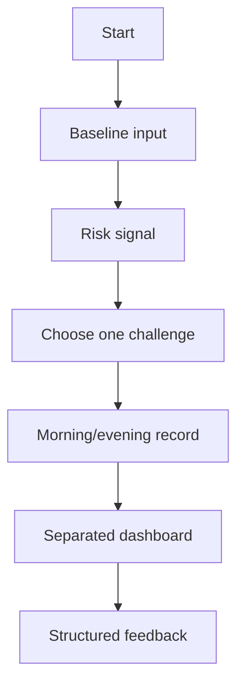

# UX flow

The core state is reachable in four actions: baseline input, risk signal, challenge selection, first measurement. The dashboard never merges a BP value, a model score, and an adherence rate into one improvement claim.
