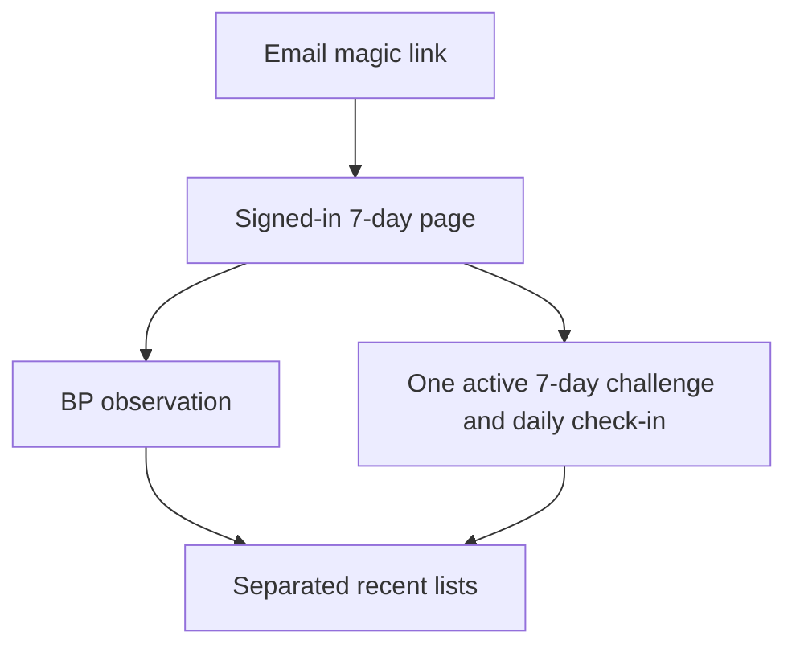
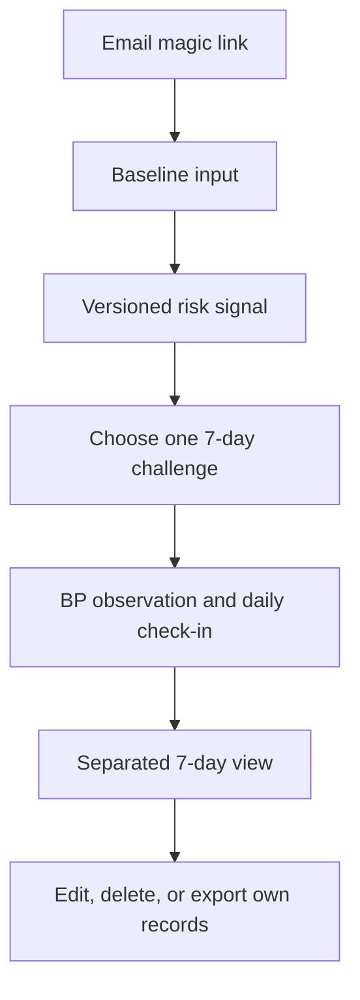

# UX flow

## Current production flow

The current web supports authentication, a concise pre-measurement checklist, BP creation, edit, explicit-confirmation delete, bounded recent-seven-day JSON export, one active seven-day challenge selection, daily check-ins, status-only check-in edit, explicit-confirmation check-in delete, and a separated seven-day read. The first check-in locks the chosen action for that challenge. Risk signal and structured feedback are not yet product-connected.

## Accepted P0 flow

The core path preserves three separate facts:

1. The model produces an **입력 기반 위험군 선별 신호** from baseline input.
2. The user records measured blood-pressure observations.
3. The user records adherence to one selected challenge.

The dashboard never merges them into a diagnosis, treatment effect, prevention claim, or single improvement score.

## Signature presentation contract

The [visual production contract](visual-production-contract.md) defines the concern-specific authorities, canonical synthetic fixtures, responsive baselines, accessibility requirements, and G0–G4 approval evidence for this flow. On mobile, the stable order is today's context, measurement action, challenge action, then recap and history. A loading or failed request must not be rendered as a confirmed empty window.

## Measurement checklist contract

- The BP form shows the checklist before the date, period, and numeric fields.
- It briefly covers preparation, resting posture, cuff/arm position, and avoiding talking or phone use during the measurement.
- The guide is a consistency aid only: it is not stored, it does not block saving, and it does not classify a reading or offer diagnosis, treatment, prevention, or emergency guidance.
- The existing morning/evening selector remains the record's only time-related input; users are encouraged to record at a similar time when possible.

## Challenge contract

- The user selects one of walking, sleep routine, or low-sodium meal.
- The selection creates one active seven-day challenge.
- Each day records `completed` or `skipped` for that active challenge.
- During its current unexpired seven-day window, a check-in can change only between `completed` and `skipped`; its date, action, challenge link, and owner stay fixed.
- During that same window, a user may delete an owned check-in after an explicit confirmation. An active challenge itself is not deleted through the web flow.
- The challenge cannot be replaced after its first check-in.
- Completion is adherence history, not evidence that blood pressure improved.

## Recovery paths

| Situation | User-visible behavior |
|---|---|
| Expired email link | Offer a new magic link without implying an account problem. |
| Expired session | Clear the local session, ask the user to sign in again, and do not report an uncertain write as saved. |
| Duplicate BP period or challenge check-in | Update intentionally or show a clear conflict; never create silent duplicates. |
| Network or storage failure | State that saving was not confirmed, offer a fresh read, then let the user decide whether another write is needed. |
| Model artifact unavailable | Show a not-ready state with no provisional score. |
| Empty seven-day window | Show an intentional empty state and the next available action. |
| Unauthorized record ID | Return not found without revealing another user's data. |
