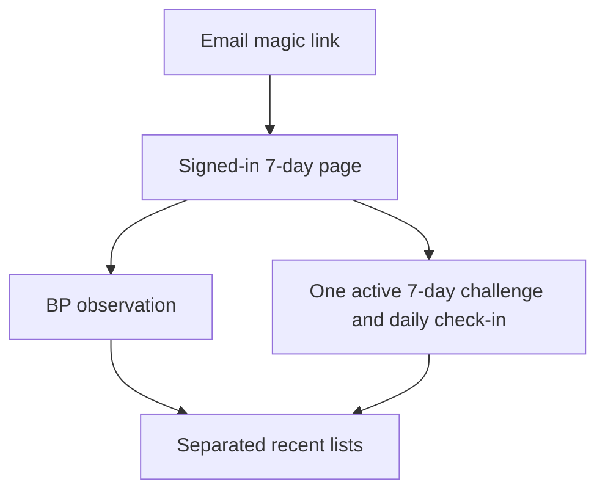
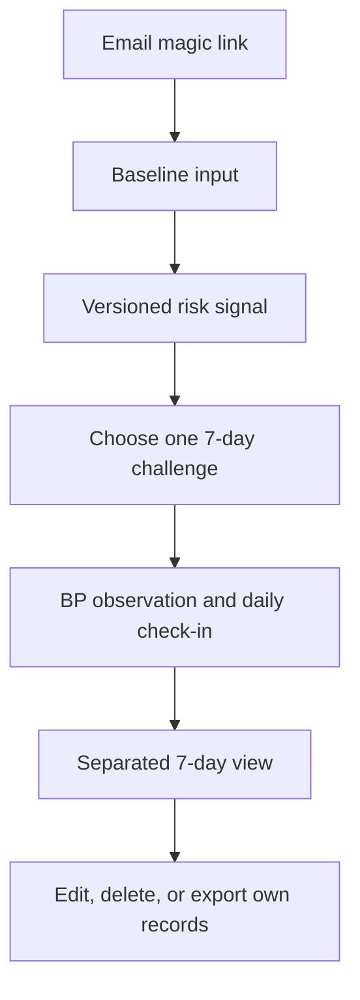

# UX flow

## Current production flow

The current web supports authentication, BP creation, one active seven-day challenge selection, daily check-ins, and a separated seven-day read. The first check-in locks the chosen action for that challenge. Delete and export exist only in the API. Risk signal, BP edit controls, measurement checklist, and structured feedback are not yet product-connected.

## Accepted P0 flow

The core path preserves three separate facts:

1. The model produces an **입력 기반 위험군 선별 신호** from baseline input.
2. The user records measured blood-pressure observations.
3. The user records adherence to one selected challenge.

The dashboard never merges them into a diagnosis, treatment effect, prevention claim, or single improvement score.

## Challenge contract

- The user selects one of walking, sleep routine, or low-sodium meal.
- The selection creates one active seven-day challenge.
- Each day records `completed` or `skipped` for that active challenge.
- The challenge cannot be replaced after its first check-in.
- Completion is adherence history, not evidence that blood pressure improved.

## Recovery paths

| Situation | User-visible behavior |
|---|---|
| Expired email link | Offer a new magic link without implying an account problem. |
| Expired session | Ask the user to sign in again and do not report an uncertain write as saved. |
| Duplicate BP period or challenge check-in | Update intentionally or show a clear conflict; never create silent duplicates. |
| Network or storage failure | Preserve a retry action and state that saving was not confirmed. |
| Model artifact unavailable | Show a not-ready state with no provisional score. |
| Empty seven-day window | Show an intentional empty state and the next available action. |
| Unauthorized record ID | Return not found without revealing another user's data. |
